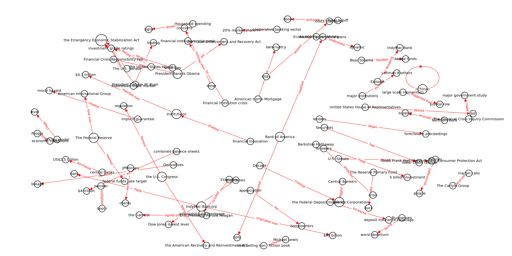
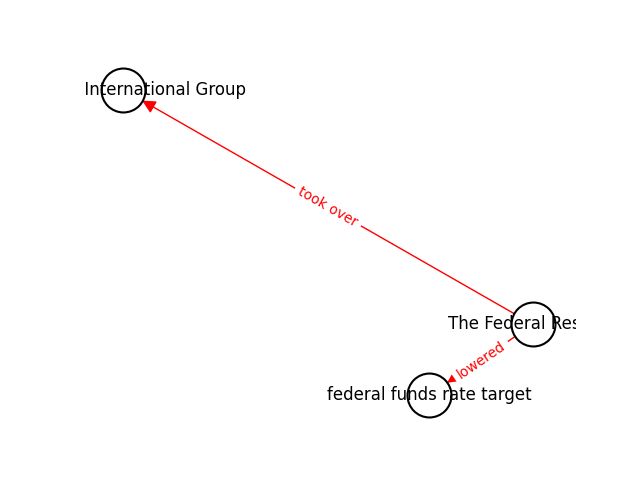

## Generating entity-relation KG graphs from wikipedia articles

This repository provides a tool for scraping wikipedia for any topic and generating a knowledge graph from the scraped
articles.

## Adaptation to new Neuralcoref version

The new [Neuralcoref](https://explosion.ai/blog/coref) from `explosion.ai` uses the state-of-the-art clustering
algorithm
[MentionRank](https://arxiv.org/abs/1804.05392) to cluster mentions in a document. This algorithm is much more accurate
than the previous one, but it is also much slower.
The new version of Neuralcoref is not compatible with the old version, so the code in this repository has been adapted
to the new version.

However, the end results are not the same as before. The new version of Neuralcoref delivers low-quality clusters, so
the results are not as good as before.
This is a known issue, and the developers are working on it.

## Installation

### Requirements

- Python 3.7
- [Wikipedia-API](https://pypi.org/project/Wikipedia-API/)
- [Spacy](https://spacy.io/)
- [Neuralcoref](https://pypi.org/project/neuralcoref/)
- [Networkx](https://networkx.github.io/)
- [spaCy en_core_web_lg](https://spacy.io/models/en#en_core_web_lg)

### Preparation

#### 1. Conda environment
We recommend using [conda](https://docs.conda.io/en/latest/). Create a new environment from the `environment.yml` file
in the root of this repository:

```bash
conda env create -f environment.yml
```

Then, activate the environment:

```bash
conda activate spacy_pos_kg
```

#### 2. Virtualenv environment
Alternatively, you can use [virtualenv](https://virtualenv.pypa.io/en/latest/). Create a new environment from the
`requirements.txt` file in the root of this repository:

```bash
virtualenv -p python3.7 venv
source venv/bin/activate
pip install -r requirements.txt
```

### Running the code

Below is an example of how to run the code. The code will scrape wikipedia for the text query `2008 recession`, generate
a knowledge graph and plot it.

```bash
python demo.py --target "2008 recession" --sub-graph-target "The federal reserve"
```

Output:


> The graph was generated using the `en_core_web_lg` model from spaCy and plotted with networkx and matplotlib.


> The sub-graph was generated for the entity "The federal reserve"